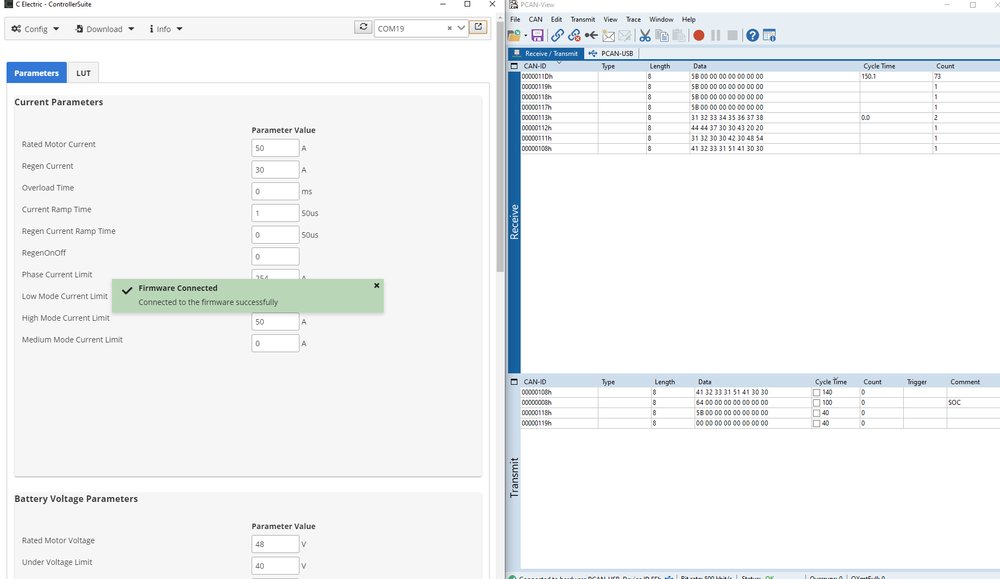
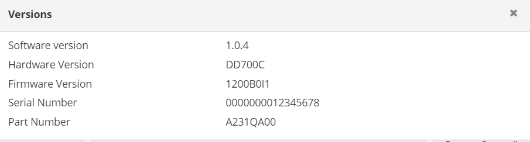
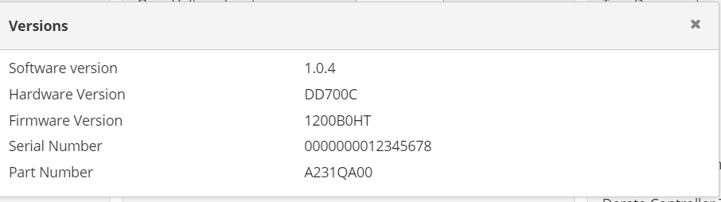

# MAKE A IN HOUSE BOOTLOADER TOOL 

* Input  = .bin file (or) .trc file
**Requirement:**
Need to Transmit the contents of .trc file to the Node which is connected through the PCAN.

**IDEA**
1. Check the Id first
2. if the id repeats, then subtract the current time with previuos occurance time stamp and give that as sleep time

Assume id 0x8
first occurence time - 744.0
Second occurence time - 1745.0
then send the second occurence one second after first occurence

Will remove first 14 lines in .trc file

**CEAD BOOTLOADER**
TOOL MESSAGE 1 : 
MCU MESSAGE 1 : 

Then click flash in the firmware

TOOL MESSAGE 2,3,4: 

**Mission:1** Accomplished: **Firmware Connected** 

**Mission:2**: Flashing Done 
# **Before:**

# **After**
 

**Bottleneck:**
Need to take trace while flashing the firmware, in any ways it can be automated

